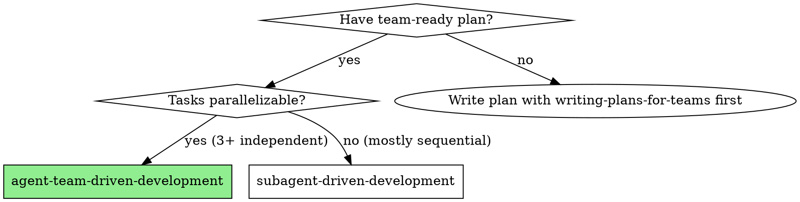
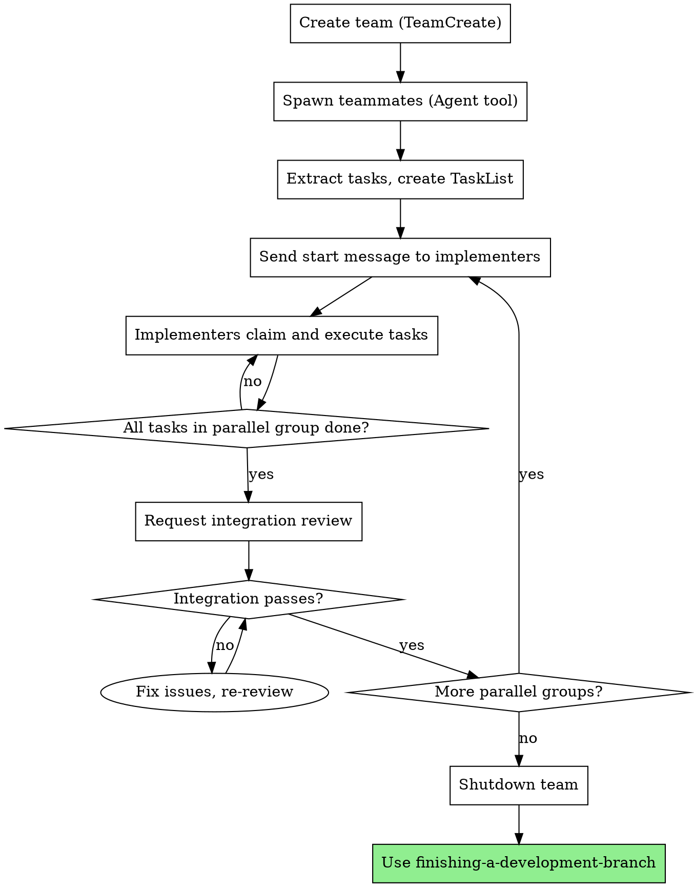

# Agent Team-Driven Development

## Overview

Execute plans using a coordinated team of persistent teammates. Multiple implementers work in parallel on independent tasks, while reviewers verify both individual task quality and integration between parallel-built components.

**Why teammates vs subagents:**
- Persistent across tasks (accumulate context)
- Coordinate via shared TaskList
- SendMessage for collaboration
- Parallel execution of independent work
- Integration verification after parallel groups

**Core principle:** Team of persistent teammates + shared task coordination + parallel execution + integration verification = fast, high-quality implementation

**Announce at start:** "I'm using the agent-team-driven-development skill to execute this plan with a coordinated team."

## When to Use



**Use when:**
- Plan has High/Medium parallelizability rating
- 2+ tasks can run in parallel
- Tasks have clear file boundaries
- Integration checkpoints defined

**Don't use when:**
- Mostly sequential tasks (> 70% blocked)
- Tasks heavily share files
- No clear parallelization opportunities

## Team Composition

| Role | Count | Responsibility |
|------|-------|----------------|
| Team Lead | 1 (you) | Orchestrate team, spawn teammates, coordinate work, final decisions |
| Implementer | 2-3 | Claim and execute tasks, write tests, commit code |
| Skeptical Architect Reviewer | 1 | Unified reviewer for spec compliance, code quality, integration |

**You are the Team Lead.** When you call TeamCreate, you automatically become the team lead. No separate teammate spawn needed.

## The Process



## Step 1: Create Team

```typescript
TeamCreate({
    team_name: "feature-auth-system",  // Based on project/feature
    description: "Implementing auth system from plan docs/superpowers/plans/2026-03-22-auth.md"
})
```

This creates:
- Team config at `~/.claude/teams/feature-auth-system/config.json`
- Shared TaskList at `~/.claude/tasks/feature-auth-system/`

## Step 2: Spawn Teammates (MANDATORY)

<HARD-GATE>
**You MUST spawn ALL teammate types. This is not optional.**

Every team requires:
- **2-3 Implementers** - Execute tasks
- **1 Skeptical Architect Reviewer** - Unified reviews (spec compliance, code quality, integration)

Skipping any teammate type violates the quality system. There are no exceptions for "small teams," "simple projects," or "experienced implementers."
</HARD-GATE>

**Spawn Implementers (2-3):**
```typescript
Agent({
    subagent_type: "general-purpose",
    team_name: "feature-auth-system",
    name: "implementer-1",
    prompt: "[Full prompt from implementer-teammate-prompt.md template]"
})
```

**Spawn Skeptical Architect Reviewer:**
```typescript
Agent({
    name: "skeptical-architect-reviewer",
    prompt: "CLAIM: [Review claim based on completed task]"
})
```

**Note:** The skeptical-architect-reviewer is spawned fresh for each review (not a persistent teammate). This ensures fresh eyes and prevents context bias.

**Use `general-purpose` for implementers** because they need Edit access for fixes.

### Anti-Rationalization: Skipping Reviewers

| Excuse | Reality |
|--------|---------|
| "We only have 2 tasks" | Even 1 task needs review |
| "Implementers can review each other" | Conflict of interest - fresh eyes required |
| "I'll review myself as team lead" | Same person doing and reviewing = no review |
| "It's a simple project" | Simple projects have bugs too |
| "Reviewers add overhead" | Debugging is more overhead |
| "I trust the implementers" | Trust ≠ correctness verification |
| "We're just prototyping" | Prototypes become production code |

## Step 3: Create TaskList

Extract tasks from plan and create in shared TaskList:

```typescript
// For each task in plan:
TaskCreate({
    subject: "Task 1: Create auth types",
    description: "[Full task description from plan]",
    addBlocks: ["4"],  // Task 4 depends on this
    addBlockedBy: []   // No dependencies
})

TaskCreate({
    subject: "Task 2: Implement API client",
    description: "[Full task description from plan]",
    addBlocks: ["4"],
    addBlockedBy: []
})

TaskCreate({
    subject: "Task 3: Create UI components",
    description: "[Full task description from plan]",
    addBlocks: ["4"],
    addBlockedBy: []
})

TaskCreate({
    subject: "Task 4: Integration",
    description: "[Full task description from plan]",
    addBlockedBy: ["1", "2", "3"]
})
```

## Step 4: Dispatch Work

Send start message to implementers:

```typescript
SendMessage({
    to: "implementer-1",
    message: "Team execution starting. Check TaskList for available tasks. Claim tasks where blockedBy is empty or resolved. Report completion via SendMessage.",
    summary: "Start work - check TaskList"
})

SendMessage({
    to: "implementer-2",
    message: "Team execution starting. Check TaskList for available tasks. Claim tasks where blockedBy is empty or resolved. Report completion via SendMessage.",
    summary: "Start work - check TaskList"
})
```

## Step 5: Monitor and Coordinate

**Track progress:**
- Teammates report completion via SendMessage
- Check TaskList periodically for overall status
- Watch for blocked tasks becoming unblocked

**Handle implementer reports:**
```
Implementer-1: "Completed Task 1. Status: DONE. Files: auth/types.py, tests/auth/test_types.py"
→ Acknowledge, check if Task 4 is now unblocked
```

**Coordinate reviews:**
- After implementer reports DONE, spawn skeptical-architect-reviewer for spec compliance review
- Reviewer checks compliance + integration
- If issues, implementer fixes, re-review
- After spec passes, spawn skeptical-architect-reviewer for code quality review

## Step 6: Integration Verification

**After each parallel group completes:**

Spawn skeptical-architect-reviewer for integration review:

```typescript
Agent({
    name: "skeptical-architect-reviewer",
    prompt: `CLAIM: Implementation of parallel tasks [1, 2, 3] is properly wired together.

Context:
- Task 1 created auth types
- Task 2 created API client
- Task 3 created UI components

Verify:
- Types from Task 1 match imports in Tasks 2, 3
- API client and UI can communicate
- Run: pytest tests/integration/test_auth.py`
})
```

**Integration reviewer checks:**
- Interface matching between components
- Import/export wiring
- Data flow correctness
- Integration tests pass

## Step 7: Team Persistence (Default)

**After all tasks complete and verified:**

**Default: Keep team active for testing and feedback**

The team persists so PO/QA can test the implementation and provide feedback. The experienced teammates can handle follow-up work without losing context.

**Team state after implementation:**
- Teammates remain active
- TaskList shows all tasks completed
- Teammates available for:
  - Bug fixes from testing
  - Clarifications for PO/QA
  - Small adjustments based on feedback

**Handoff message to user:**
```
Implementation complete. Team is active and ready for:
- PO/QA testing
- Bug fixes from feedback
- Adjustments based on review

Teammates have full context of the implementation.
When ready to close the team, say "shutdown team".
```

**Optional: Explicit shutdown**

When user says "shutdown team" or work is fully complete:

```typescript
// Send shutdown request to each implementer teammate
SendMessage({
    to: "implementer-1",
    message: {
        type: "shutdown_request",
        reason: "Work complete, shutting down team"
    }
})

// Wait for shutdown_response from each implementer
// After all approve:

TeamDelete()
```

**Note:** skeptical-architect-reviewer is spawned fresh per review, so no shutdown needed for reviewers.

## Communication Patterns

**Work dispatch (Team Lead → Implementer):**
```
SendMessage({ to: "implementer-1", message: "Start work on Task 1" })
```

**Status report (Implementer → Team Lead):**
```
SendMessage({
    to: "team-lead",  // Or just send without to field
    message: "Task 1 complete. Status: DONE. Files changed: auth/types.py"
})
```

**Review request (spawn fresh reviewer per task):**
```typescript
Agent({
    name: "skeptical-architect-reviewer",
    prompt: `CLAIM: Implementation at ${baseSha}..${headSha} matches Task 1 spec: [task_spec_text]`
})
```

**Review result (Reviewer → Team Lead):**
```
SendMessage({
    message: "Task 1 review complete. Status: APPROVED. Issues: None."
})
```

**Broadcast (Team Lead → All):**
```
SendMessage({
    to: "*",
    message: "Critical: Tests failing on main. Pause current work."
})
```

## Model Selection

**Implementers:** Use efficient model for well-specified tasks
- Touches 1-2 files with complete spec → fast model
- Touches multiple files with integration → standard model
- Requires design judgment → capable model

**Skeptical Architect Reviewer:** Uses capable model
- Review requires understanding full context
- Integration verification needs architectural understanding
- Spawned fresh per review (not persistent teammate)

## Handling Issues

**Implementer reports BLOCKED:**
1. Read blocker description
2. Provide context and re-dispatch, OR
3. Upgrade model and re-dispatch, OR
4. Break task into smaller pieces

**Implementer reports DONE_WITH_CONCERNS:**
1. Read concerns
2. If about correctness: address before review
3. If observations: note and proceed to review

**Review finds issues:**
1. Send fix request to implementer who owns the task
2. Implementer fixes and reports back
3. Re-request review
4. Repeat until approved

## Red Flags

**Never:**
- Skip integration verification for parallel tasks
- Let multiple implementers claim same task
- Proceed without shutdown approval from teammates
- Ignore blockedBy dependencies
- Start implementation on main/master without explicit consent
- Skip reviews (spec compliance OR code quality)

**Always:**
- Create TaskList with proper dependencies
- Verify file ownership before claiming tasks
- Run integration checks after parallel groups
- Get shutdown approval from implementers before TeamDelete
- Follow TDD for each task
- Spawn fresh skeptical-architect-reviewer for each review

## Anti-Pattern: "This Task Is Too Simple To Review"

**EVERY task gets reviewed. No exceptions.**

| Rationalization | Reality |
|-----------------|---------|
| "It's just a few lines" | Bugs hide in simple code too |
| "It's only types/interfaces" | Wrong types cause cascading failures |
| "The implementer is experienced" | Everyone makes mistakes |
| "We're in a hurry" | Skipping review costs more time later |
| "I reviewed it mentally" | Fresh eyes catch things you miss |
| "It's a trivial fix" | "Trivial" fixes introduce regressions |
| "Reviews slow us down" | Debugging is slower than reviewing |

**If you find yourself thinking a task doesn't need review, that's exactly when you need it most.**

<HARD-GATE>
**No task is too simple for review.** Spec compliance review → Code quality review → Integration verification. This sequence is MANDATORY for EVERY task, regardless of perceived complexity.

Violating this gate means violating the entire quality system.
</HARD-GATE>

## Integration

**Required workflow skills:**
- **superpowers:using-git-worktrees** - REQUIRED: Set up isolated workspace
- **superpowers:writing-plans-for-teams** - Creates the team-ready plan
- **superpowers:requesting-code-review** - Code review template
- **superpowers:finishing-a-development-branch** - Complete after all tasks

**Teammates should use:**
- **superpowers:test-driven-development** - TDD for each task

**Alternative workflow:**
- **superpowers:subagent-driven-development** - Sequential execution when parallelization not beneficial

## Teammate Prompt Templates

- `./implementer-teammate-prompt.md` - Implementer role (persistent teammate)

**Reviews use:** `agents/skeptical-architect-reviewer.md` - Unified reviewer for SPEC/PLAN/CODE reviews (spawned fresh per review)
