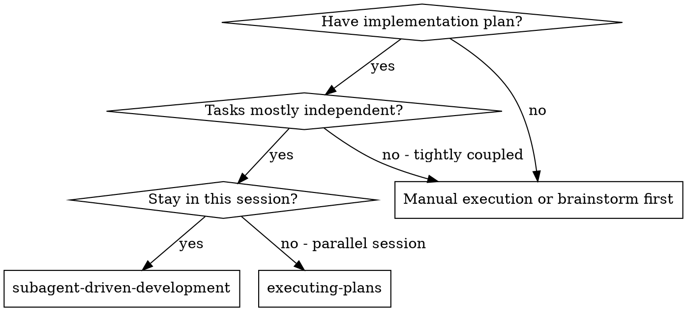
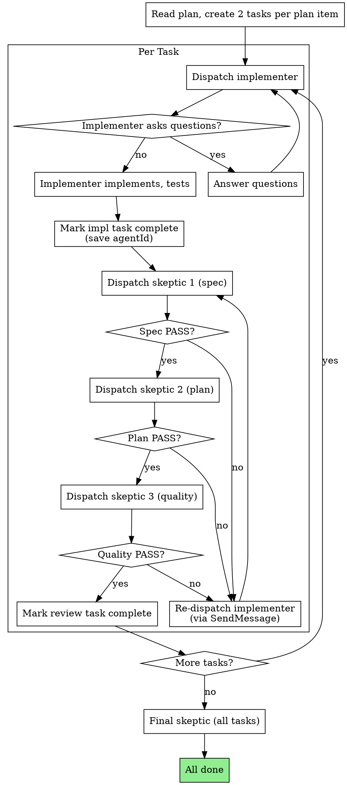

# Subagent-Driven Development

Execute plan by dispatching fresh subagent per task, with two-stage review after each using skeptical-architect-reviewer.

**Why subagents:** You delegate tasks to specialized agents with isolated context. By precisely crafting their instructions and context, you ensure they stay focused and succeed at their task. They should never inherit your session's context or history — you construct exactly what they need. This also preserves your own context for coordination work.

**Core principle:** Fresh subagent per task + two-stage review (spec then quality) = high quality, fast iteration

## When to Use



## Task Creation

**For each task in the plan, create TWO tasks:**

1. **Implementation task** - "Implement Task N: [name]"
2. **Review task** - "Review Task N: [name]" - blocked by implementation task

**Task lifecycle:**
- Implementation task → in_progress when implementer dispatched
- Implementation task → completed when implementer returns DONE (save `agentId` from response)
- Review task → in_progress when first skeptic dispatched
- Review task → completed ONLY when all 3 skeptics PASS

**Review task contains 3 independent skeptic runs (all must PASS):**
1. Spec compliance - does it match the spec?
2. Plan compliance - does it match the plan?
3. Code quality - is it well-built?

If any skeptic returns FAIL → re-dispatch implementer via `SendMessage` with feedback, then re-run all 3 skeptics fresh.

<HARD-GATE>
**ALWAYS create review task. No exceptions.**

Even for "trivial" tasks:
- "Add re-export to index file" → still needs review task
- "Fix typo in comment" → still needs review task
- "Update import path" → still needs review task

**Why:** "Simple" tasks are where mistakes hide. Wrong export name, missing import, subtle breaking change. Fresh skeptic catches these. Skipping review on "simple" tasks is how technical debt accumulates.

No "this is too simple." No "not worth reviewing." Always create both tasks.
</HARD-GATE>

## Re-dispatch Rules

**Implementer:** Re-dispatch via `SendMessage` to preserve context
```
agentId: abd266b37da59af87 (use SendMessage with to: 'abd266b37da59af87' to continue this agent)
→ SendMessage({ to: 'abd266b37da59af87', message: 'skeptic feedback: [issues]' })
```

**All 3 Skeptics:** Always dispatch **fresh** (new Agent call) - never restore session
```
→ Agent({ name: "skeptical-architect-reviewer", prompt: "CLAIM: Spec compliance - ..." })
→ Agent({ name: "skeptical-architect-reviewer", prompt: "CLAIM: Plan compliance - ..." })
→ Agent({ name: "skeptical-architect-reviewer", prompt: "CLAIM: Code quality - ..." })
```
**Why:** Fresh skeptic = unbiased review. Each skeptic works independently without seeing other reviews.

## The Process



## Reviews with skeptical-architect-reviewer

All 3 reviews use fresh skeptical-architect-reviewer instances:

**1. Spec compliance:**
```
Agent({
    name: "skeptical-architect-reviewer",
    prompt: "CLAIM: Implementation matches spec: [spec_text]"
})
```

**2. Plan compliance:**
```
Agent({
    name: "skeptical-architect-reviewer",
    prompt: "CLAIM: Implementation matches plan task: [plan_task_text]"
})
```

**3. Code quality:**
```
Agent({
    name: "skeptical-architect-reviewer",
    prompt: "CLAIM: All code from git diff is well-built and follows project standards"
})
```

**Final review (after all tasks):**
```
Agent({
    name: "skeptical-architect-reviewer",
    prompt: "CLAIM: All tasks from plan are complete and integrated"
})
```

## Model Selection

Use the least powerful model that can handle each role:

**Mechanical implementation** (isolated functions, clear specs): fast, cheap model

**Integration and judgment** (multi-file, debugging): standard model

**Architecture, design, and review**: most capable model

## Handling Implementer Status

**DONE:** Proceed to spec compliance review.

**DONE_WITH_CONCERNS:** Read concerns. If about correctness, address before review. If observations, note and proceed.

**NEEDS_CONTEXT:** Provide missing context and re-dispatch.

**BLOCKED:** Assess blocker:
1. Context problem → provide more context, re-dispatch same model
2. Reasoning problem → re-dispatch with more capable model
3. Task too large → break into smaller pieces
4. Plan wrong → escalate to human

**Never** ignore an escalation or force retry without changes.

## Prompt Templates

- `./implementer-prompt.md` - Dispatch implementer subagent

## Red Flags

**Never:**
- Start implementation on main/master without explicit consent
- Skip any of the 3 reviews (spec, plan, quality)
- Proceed with unfixed issues
- Dispatch multiple implementers in parallel (conflicts)
- Make subagent read plan file (provide full text)
- Skip scene-setting context
- Ignore subagent questions
- Accept "close enough" on any review
- Restore skeptic session (always dispatch fresh)
- Move to next task while review task still in_progress

**Always:**
- Create review task for every task
- Run all 3 skeptics (spec → plan → quality)
- Re-run all 3 skeptics after implementer fixes
- Answer implementer questions before they proceed

<HARD-GATE>
**Do NOT proceed to the next task until both skeptic reviews (spec + code quality) PASS for the current task.**

**Why:** A small misunderstanding in Task 1 becomes wrong assumptions in Task 2, wrong interfaces in Task 3, and by Task 15 you're debugging a cascade of compounding issues. Early reviews are cheap; late debugging is expensive.

No exceptions. No "this task is simple." No "I'll review after." Both reviews must pass before moving on.
</HARD-GATE>

## Integration

**Required workflow skills:**
- **superpowers:writing-plans** - Creates the plan this skill executes

**Subagents should use:**
- **superpowers:test-driven-development** - TDD for each task

**Alternative workflow:**
- **superpowers:executing-plans** - Parallel session instead of same-session
