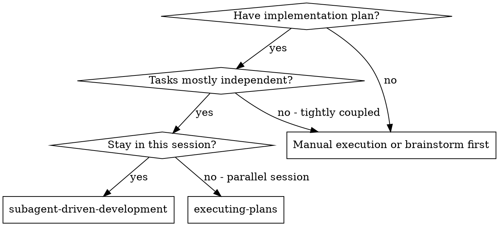
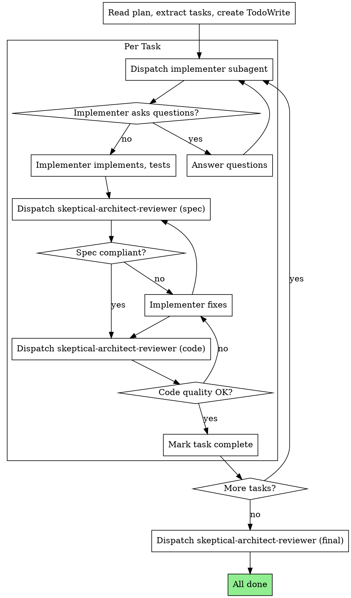

# Subagent-Driven Development

Execute plan by dispatching fresh subagent per task, with two-stage review after each using skeptical-architect-reviewer.

**Why subagents:** You delegate tasks to specialized agents with isolated context. By precisely crafting their instructions and context, you ensure they stay focused and succeed at their task. They should never inherit your session's context or history — you construct exactly what they need. This also preserves your own context for coordination work.

**Core principle:** Fresh subagent per task + two-stage review (spec then quality) = high quality, fast iteration

## When to Use



## The Process



## Reviews with skeptical-architect-reviewer

All reviews use the skeptical-architect-reviewer agent. Pass appropriate CLAIM:

**Spec compliance review:**
```
Agent({
    name: "skeptical-architect-reviewer",
    prompt: "CLAIM: Implementation at [base_sha]..[head_sha] matches Task N spec: [task_spec_text]"
})
```

**Code quality review:**
```
Agent({
    name: "skeptical-architect-reviewer",
    prompt: "CLAIM: Code at [base_sha]..[head_sha] is well-built and follows project standards"
})
```

**Final review:**
```
Agent({
    name: "skeptical-architect-reviewer",
    prompt: "CLAIM: All tasks from plan [plan_path] are complete and integrated"
})
```

## Model Selection

Use the least powerful model that can handle each role:

**Mechanical implementation** (isolated functions, clear specs): fast, cheap model

**Integration and judgment** (multi-file, debugging): standard model

**Architecture, design, and review**: most capable model

## Handling Implementer Status

**DONE:** Proceed to spec compliance review.

**DONE_WITH_CONCERNS:** Read concerns. If about correctness, address before review. If observations, note and proceed.

**NEEDS_CONTEXT:** Provide missing context and re-dispatch.

**BLOCKED:** Assess blocker:
1. Context problem → provide more context, re-dispatch same model
2. Reasoning problem → re-dispatch with more capable model
3. Task too large → break into smaller pieces
4. Plan wrong → escalate to human

**Never** ignore an escalation or force retry without changes.

## Prompt Templates

- `./implementer-prompt.md` - Dispatch implementer subagent

## Red Flags

**Never:**
- Start implementation on main/master without explicit consent
- Skip reviews (spec compliance OR code quality)
- Proceed with unfixed issues
- Dispatch multiple implementers in parallel (conflicts)
- Make subagent read plan file (provide full text)
- Skip scene-setting context
- Ignore subagent questions
- Accept "close enough" on spec compliance
- Skip review loops
- Let implementer self-review replace actual review
- Start code quality review before spec compliance passes
- Move to next task while review has open issues

**Always:**
- Two-stage review per task (spec → code quality)
- Re-review after fixes
- Answer implementer questions before they proceed

<HARD-GATE>
**Do NOT proceed to the next task until both skeptic reviews (spec + code quality) PASS for the current task.**

**Why:** A small misunderstanding in Task 1 becomes wrong assumptions in Task 2, wrong interfaces in Task 3, and by Task 15 you're debugging a cascade of compounding issues. Early reviews are cheap; late debugging is expensive.

No exceptions. No "this task is simple." No "I'll review after." Both reviews must pass before moving on.
</HARD-GATE>

## Integration

**Required workflow skills:**
- **superpowers:writing-plans** - Creates the plan this skill executes

**Subagents should use:**
- **superpowers:test-driven-development** - TDD for each task

**Alternative workflow:**
- **superpowers:executing-plans** - Parallel session instead of same-session
