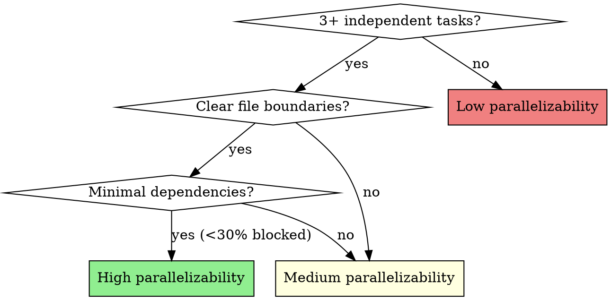

# Writing Plans for Teams

## Overview

Write comprehensive implementation plans designed for team execution. Plans include dependency annotations, parallelizability assessment, and explicit file ownership to enable 2-3 implementers to work in parallel without conflicts.

**Announce at start:** "I'm using the writing-plans-for-teams skill to create a team-ready implementation plan."

**Context:** This should be run in a dedicated worktree (created by brainstorming skill).

**Save plans to:** `docs/superpowers/plans/YYYY-MM-DD-<feature-name>.md`
- (User preferences for plan location override this default)

## Key Differences from writing-plans

| Original | Team-Enabled |
|----------|--------------|
| Sequential task list | Dependency-annotated task graph |
| Single implementer assumed | 2-3 parallel implementers supported |
| No parallelizability check | Explicit fitness check for team execution |
| Generic handoff | Handoff based on parallelizability assessment |

## Fitness Check

**Before writing tasks, assess parallelizability:**



**High Parallelizability:** Use agent-team-driven-development
- 3+ independent tasks with clear boundaries
- Tasks grouped by subsystem/file area
- < 30% of tasks have sequential dependencies
- Different files per task (no conflicts)

**Medium Parallelizability:** Either approach works
- Some independent tasks mixed with sequential chains
- 2-4 parallel paths possible
- Some shared files between tasks

**Low Parallelizability:** Use subagent-driven-development
- Mostly sequential tasks (> 70% blocked)
- Each task depends on previous output
- Shared state modifications between tasks

See `./parallelizability-check.md` for detailed criteria.

## Scope Check

If the spec covers multiple independent subsystems, it should have been broken into sub-project specs during brainstorming. If it wasn't, suggest breaking this into separate plans — one per subsystem. Each plan should produce working, testable software on its own.

## File Structure

Before defining tasks, map out which files will be created or modified. **This is critical for parallel execution** — implementers need to know file ownership to avoid conflicts.

- Design units with clear boundaries and well-defined interfaces
- Each file should have one clear responsibility
- **Explicitly note which tasks touch which files**
- Files that change together should live together
- In existing codebases, follow established patterns

## Plan Document Header

**Every plan MUST start with this header:**

```markdown
# [Feature Name] Implementation Plan

> **Parallelizability:** [High/Medium/Low] - [brief explanation]
>
> **For agentic workers:** If parallelizable, REQUIRED SUB-SKILL: Use superpowers:agent-team-driven-development. Otherwise, use superpowers:subagent-driven-development or superpowers:executing-plans.

**Goal:** [One sentence describing what this builds]

**Architecture:** [2-3 sentences about approach]

**Tech Stack:** [Key technologies/libraries]

---
```

## Task Structure with Dependencies

````markdown
### Task N: [Component Name]

**Files:**
- Create: `exact/path/to/file.py`
- Modify: `exact/path/to/existing.py:123-145`
- Test: `tests/exact/path/to/test.py`

**Dependencies:**
- Depends on: [Task IDs that must complete first, or "None"]
- Parallelizable with: [Task IDs that can run concurrently, or "None"]

- [ ] **Step 1: Write the failing test**

```python
def test_specific_behavior():
    result = function(input)
    assert result == expected
```

- [ ] **Step 2: Run test to verify it fails**

Run: `pytest tests/path/test.py::test_name -v`
Expected: FAIL with "function not defined"

- [ ] **Step 3: Write minimal implementation**

```python
def function(input):
    return expected
```

- [ ] **Step 4: Run test to verify it passes**

Run: `pytest tests/path/test.py::test_name -v`
Expected: PASS

- [ ] **Step 5: Commit**

```bash
git add tests/path/test.py src/path/file.py
git commit -m "feat: add specific feature"
```
````

## Dependency Graph Guidelines

**When tasks can run in parallel:**
- Different files/subsystems
- No shared state modifications
- Independent functionality

**When tasks must be sequential:**
- Later task imports from earlier task
- Earlier task defines interfaces later task uses
- Shared file modifications
- Data flow from one to another

**Example dependency graph:**
```
Task 1 (Core types) → Task 2 (API client) → Task 4 (Integration)
                   → Task 3 (UI components) → Task 4

Tasks 2 and 3 can run in parallel (different files)
Task 4 waits for both 2 and 3
```

## Plan Review Loop

After writing the complete plan:

1. Use skeptical-architect-reviewer agent:
   ```
   Agent({
       name: "skeptical-architect-reviewer",
       prompt: "CLAIM: Plan at [plan-path] based on spec at [spec-path] is complete and ready for execution."
   })
   ```
2. If FAIL: fix issues, re-dispatch, repeat until PASS
3. If loop exceeds 3 iterations, surface to human for guidance

## Execution Handoff

After saving the plan, offer execution choice based on parallelizability:

**High Parallelizability:**
```
Plan complete and saved to `docs/superpowers/plans/<filename>.md`.

**Recommended: Team-Driven Execution** (2-3 parallel implementers)
- Independent tasks can run concurrently
- Faster completion through parallelization
- Integration verification after parallel groups complete

Alternative options:
1. **Subagent-Driven** - Sequential execution, one task at a time
2. **Inline Execution** - Execute in this session

Which approach?
```

**Medium/Low Parallelizability:**
```
Plan complete and saved to `docs/superpowers/plans/<filename>.md`.

**Recommended: Subagent-Driven Execution** (sequential)
- Tasks have dependencies that favor sequential execution

Alternative options:
1. **Team-Driven** - Some parallelization possible
2. **Inline Execution** - Execute in this session

Which approach?
```

**If Team-Driven chosen:**
- **REQUIRED SUB-SKILL:** Use superpowers:agent-team-driven-development

**If Subagent-Driven chosen:**
- **REQUIRED SUB-SKILL:** Use superpowers:subagent-driven-development

**If Inline Execution chosen:**
- **REQUIRED SUB-SKILL:** Use superpowers:executing-plans

## Integration Points

When tasks run in parallel, identify integration points:

```markdown
## Integration Checkpoints

After tasks [1, 2, 3] complete, verify:
- [ ] Types exported from Task 1 match imports in Tasks 2, 3
- [ ] API client from Task 2 integrates with UI from Task 3
- [ ] Run integration test: `pytest tests/integration/test_feature.py`
```

## Remember

- Exact file paths always
- Complete code in plan (not "add validation")
- Exact commands with expected output
- **Dependency annotations for every task**
- **Parallelizable with annotations where applicable**
- **Integration checkpoints between parallel tasks**
- Reference relevant skills with @ syntax
- DRY, YAGNI, TDD, frequent commits

## Red Flags

**Never:**
- Skip the fitness check
- Omit dependency annotations
- Create tasks with ambiguous file ownership
- Forget integration checkpoints for parallel tasks
- Over-parallelize tightly coupled tasks
